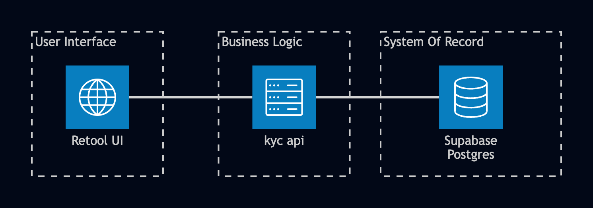
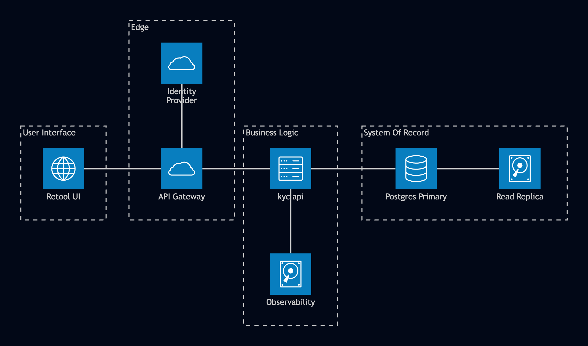

# kyc-api: how it's built, and why

Three pieces. Retool is the screen a reviewer looks at: a table of pending cases, a form to approve or reject one. Supabase Postgres holds the case records and a log of every decision ever made. `kyc-api` sits between them, and it's the only piece allowed to talk to the database. Retool never gets a database credential; every action goes out as a request to `kyc-api`, which decides what's actually allowed before anything happens.

One piece of code, and only one, can ever change the database. That's the whole point of this design. Every decision below protects that fact.

## Architecture

### Current

Retool renders the queue and the forms. `kyc-api` holds every rule about what's allowed. Supabase Postgres stores the case records and the append-only audit log. Retool authenticates to `kyc-api` with a shared secret and a header naming the reviewer; `kyc-api` authenticates to Postgres with a service-role key that never leaves the repository layer.

### Productionized

The shape doesn't change. What gets added is everything a real production system needs and a demo doesn't: an API gateway in front of `kyc-api` for rate limiting and auth termination, a real identity provider behind that gateway instead of a shared secret, logs/metrics/tracing wired up as a first-class concern rather than console output, and a managed Postgres instance with a read replica instead of a single connection. None of this changes who's allowed to talk to the database. It's still exactly one thing.

## Why the system is split into three parts

The service layer, built end to end by Devin, is what makes that split possible: the one thing standing between a screen full of buttons and a database that would otherwise do whatever it's told. There's a real shortcut that would remove it. Supabase supports Row-Level Security, which restricts which rows a given database user can see, and Retool can connect straight to Postgres without a service layer at all. Combine the two and the middle piece disappears: point Retool at the database, let Row-Level Security keep each reviewer in their lane, and there's nothing extra to build or host.

That covers who can see what. It has nothing to say about what someone's allowed to do. Row-Level Security can express "this reviewer only sees cases assigned to their team." It can't express "this reviewer can't approve the case they just rejected." That's a question of sequence and history, and Row-Level Security has no concept of either. It can't write a structured audit entry, and it can't enforce which status a case is legally allowed to move to next. Those rules would end up inside Retool's own query editor: the one part of this system with the least review, the least testing, and the least protection against a typo breaking a compliance rule. A dedicated service behind one shared secret is a far smaller thing to secure than a live database credential sitting inside a UI tool.

## Why Postgres, and why Supabase

The data is relational: one case has many audit events, each pointing back to exactly one case, and the two need to stay consistent. The questions this system answers are the same shape: which cases has a reviewer touched, what happened to a case over its full history, how many decisions got made last quarter. Those are joins and filters, the kind a table-and-foreign-key model answers directly.

A document store, DynamoDB or MongoDB, would need duplicated data across documents to answer the same questions, or a second system just for reporting. It also wouldn't give us two guarantees this depends on: a real multi-statement transaction, and a database-level rule that a whole table is insert-only. Most document databases lack cross-document transactions entirely, or bolted them on later, and none offer anything as direct as a Postgres trigger that flatly rejects an update or delete.

Supabase was chosen for speed of delivery: Postgres underneath, a managed instance, a generated client library, none of the operational setup a self-hosted database needs. That was the right tradeoff for proving out the pattern quickly. Real production volume would eventually need connection pooling, read replicas, and dedicated infrastructure, a conversation that happens on top of plain Postgres either way, so there's nothing here to migrate away from.

## Keeping the audit trail honest

Every action on a case writes a row to an audit log: who did what, to which case, when. The table has one rule that matters more than any other: rows can be added, never edited or deleted, enforced by a database trigger at the storage layer. Our own code already only ever inserts into that table. So why does the trigger exist at all?

Because a rule enforced only in application code holds only as long as every future line of code respects it: a "fix a typo in the log" feature added under deadline pressure, a one-off debugging script, someone with access opening a SQL console directly. None of that is far-fetched; it's the normal way systems get touched over time. A trigger holds regardless. It isn't a rule the application follows. It's a rule the database enforces, no matter who's asking.

Approving, rejecting, or escalating a case triggers two writes: a new audit-log row, then a status change, in that order. If the audit write fails, the whole request fails and the case stays where it was. The two failure modes aren't equally bad. A decision that took effect with no record of it is invisible risk sitting in production, discoverable only if someone goes looking. A decision that didn't take effect just needs a retry: visible immediately, safe to retry. We accept the smaller cost of occasionally blocking a legitimate action to avoid the larger cost of an unrecorded one. Viewing a case is the one exception: a logging failure never blocks a read, because looking at a record carries none of that risk.

That ordering isn't the same as atomicity. Atomic means both writes succeed together or neither does, with no state in between. Today the audit write and the status update are two separate database calls rather than one transaction. That leaves a real gap: if the audit row writes successfully and the status update then fails, the case sits in its old status with an audit entry describing a decision that, from the case's point of view, never happened. It's a narrow window, and it surfaces as a visible error rather than a silent one, but it's not the same guarantee as a real transaction.

Idempotency is related but separate: does a duplicate request produce the same result twice, or double up? Retries are safe in the common case, because the service checks the case's current status before either write, and a final status like verified or rejected has no further legal transition; a retry after a successful decision gets rejected outright. The gap is the same narrow window: if the audit write succeeds but the status update then fails, a retry lands on the case's still-earlier status, updates it correctly, and leaves two audit entries for one logical decision. The case ends up correct either way. The audit log, in that one case, doesn't. Closing this properly, a real transaction plus a real idempotency key, belongs in the system from day one. It wasn't prioritized given the time available for this project, and it has to be in place before production.

## What I'd do with more time

Wrap the audit-log write and the status update in a single database transaction, or move both into one Postgres function called in one round trip, so they commit or roll back together. That closes the atomicity gap directly, and most of the idempotency gap follows from it: there's no longer a moment where one write succeeds and the other doesn't.

Add a real idempotency key: a value the client generates once per action, sent with the request, so a retry carrying the same key gets short-circuited before it ever reaches the state machine, instead of being rejected after the fact. Stronger guarantee, cheap to add.

The reviewer check described above, blocking the same person from approving their own last decision, is real but narrower than a full two-person approval process, where one person proposes and a different, specific person signs off before it takes effect. If that's ever required, the audit log already has the history to build it as an extension of what's here.

The identity behind every request is a shared secret plus a plain header naming the reviewer's email. There's no real login system behind it, deliberately: this prototype exists to argue that identity and access should be bought from Retool rather than built here, and wiring in a full login system would have undercut that argument.

## A note on implementation

The code is organized into three layers: routes translate a web request into a function call, the service layer holds every rule about what's legal, repositories are the only code allowed to query the database. Single Responsibility Principle: each layer has exactly one reason to change, and the rule for what's legal lives in exactly one place no matter how many routes or future features call into it.

Approve, reject, and escalate are each implemented as their own small class rather than as branches inside one function. Open/Closed Principle: a fourth decision type later means writing one new class. The three that already work stay untouched.
